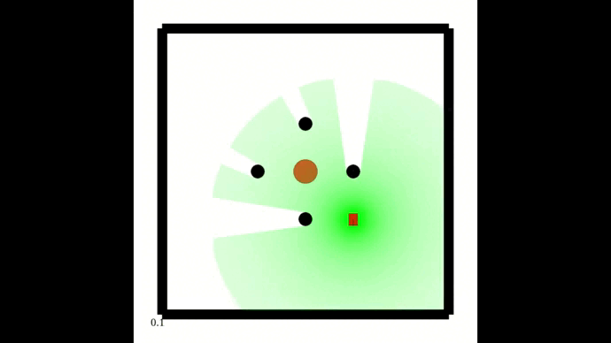

``### MultiVehicleEnv
This is a simulator designed for MARL(Multi-Agent Reinforcement Learning) Algorithm researchers to train robot motion control strategies.

- The simulator models robots with Ackerman, Mecanum and differential steering and lidar, which can be applied to common tasks such as obstacle avoidance, navigation, environment exploration,etc.

- We realize the method proposed in our paper to accelerate robot kinematics simulation and lidar rendering, achieving about **2.56** and **14.2** times simulation speedup respectively. 




## Code Structure
```plaintext
.
├─docs/
├─src/
│  ├─MultiVehicleEnv/
│  │  ├─scenarios/
│  │  ├─basic.py
│  │  ├─environment.py
│  │  ├─evaluate.py
│  │  ├─geometry.py
│  │  ├─GUI.py
│  │  ├─rendering.py
│  │  ├─scenario.py
│  │  └─utils.py
│  └─setup.py
├─test/
└─README.md
```
- The main part of simulator is implemented under the folder `src/MultiVehicleEnv` , including the attribute definitions and physical modeling of `Vehicle`, `Obstacle` and `Lidar`, as well as API for the whole system.

- In `src/MultiVehicleEnv/scenarios`, we combine the above elements to form complete scenarios. Under the folder `src/MultiVehicleEnv/test`, for each scenario we have defined, we train the RL strategy to accomplish a specific task.


## Install
### Prerequisites
Python (3.8.10), OpenAI gym (0.18.3), pyglet(1.5.15), numpy (1.20.3)
### Instructions
Just install this repo by:
```shell
git clone https://github.com/efc-robot/MultiVehicleEnv.git
cd MultiVehicleEnv/src
pip install -e .
```

## Getting Started
The API of simulator is Gym-like, which is friendly and easy to understand for researchers.

You can take `src/MultiVehicleEnv/test/test_eval_auto_with_gui.py` as an example to get started. In this script, we instantiate a scenario for cooperative navigation (defined in `src/MultiVehicleEnv/scenarios/multi_reach.py`) and obtain the simulation environment to  train and evaluate RL strategy. 


